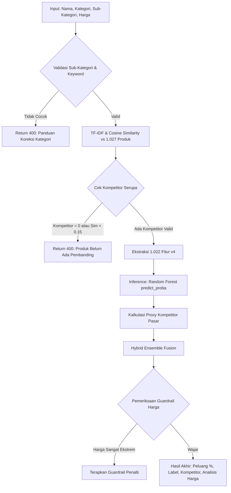

# DOKUMENTASI RESMI: CARA KERJA MODEL MACHINE LEARNING V4

> **Versi Dokumen:** Model v4 (Production Active)  
> **File Model:** `models/model_umkm_bogor_v4.joblib`  
> **Fokus Utama:** Keadilan Sektoral (*Category-Stratified Fairness*), Eliminasi *Target Leakage*, dan *Hybrid Ensemble Cold-Start Proxy*.

---

## 1. Latar Belakang Evolusi Model: Dari v3 ke v4

Pada model historis terdahulu (**Model v3**), terdapat dua kelemahan metodologis mendasar:
1. **Bias Ambang Batas Global ($34$ Unit):**  
   Model v3 menggunakan satu ambang median global ($34.0$ unit terjual) untuk semua produk. Akibatnya, $90.1\%$ produk pakaian dan aksesoris divonis gagal (label 0 / peluang 0%) semata-mata karena perputaran busana di e-commerce tidak secepat makanan basah.
2. **Ketergantungan *Target Leakage*:**  
   Fitur `popularity_score` ($rating \times \ln(terjual)$) dan `revenue_proxy_log` secara matematis mengandung variabel target penjualan di dalamnya. Saat inferensi produk baru yang belum memiliki data penjualan, model mengalami distorsi.

**Model v4** memecahkan kedua masalah ini secara tuntas melalui pelatihan ulang (*retraining*) dengan metodologi persentil intra-kategori dan pembersihan fitur *leakage*.

---

## 2. Fase Pelatihan (Training Phase v4)

### A. Dataset & Preprocessing
* **Ukuran Data:** 1.027 produk UMKM Kota & Kabupaten Bogor dari Tokopedia, Shopee, dan Lazada (kondisi 100% bersih tanpa missing value).
* **Text Preprocessing:** Nama produk dibersihkan menggunakan pemotong kata dasar (Stemmer Sastrawi) dan eliminasi stopword bahasa Indonesia.
* **IQR Outlier Clipping:** Membatasi pencilan harga ekstrim agar distribusi data tetap rasional.

### B. Strategi Auto-Labeling (Persentil 50% Intra-Kategori)
Alih-alih memukul rata angka 34 ke seluruh kategori, Model v4 menerapkan pemeringkatan persentil di dalam masing-masing kategori:

```python
# Formula Labeling Model v4
df['rank_terjual_kat'] = df.groupby('kategori')['jumlah_terjual'].rank(method='first', pct=True)
df['label'] = (df['rank_terjual_kat'] > 0.50).astype(int)
```

**Distribusi Kelas Hasil Labeling v4:**
* Makanan: 208 Laku (1) vs 208 Kurang Laku (0) — $50.0\%$
* Minuman: 85 Laku (1) vs 86 Kurang Laku (0) — $49.7\%$
* Pakaian & Fashion: 207 Laku (1) vs 208 Kurang Laku (0) — $49.9\%$
* Aksesoris & Souvenir: 12 Laku (1) vs 13 Kurang Laku (0) — $48.0\%$

Metodologi ini menjamin keadilan sempurna ($50\% : 50\%$) di setiap sektor bisnis UMKM.

### C. Rekayasa Fitur (Feature Engineering v4 — 1.022 Dimensi)

Model v4 hanya menggunakan fitur-fitur yang **benar-benar tersedia saat pengguna menginput produk baru**:

| No | Nama Fitur | Tipe | Dimensi | Deskripsi |
|:---:|---|---|:---:|---|
| 1 | **TF-IDF Vectorizer** | Teks | 1.000 | Ekstraksi unigram & bigram dari nama produk bersih (kata kunci bernilai tinggi). |
| 2 | **One-Hot Encoding** | Kategorikal | 19 | Representasi biner untuk 4 Kategori dan 10 Sub-Kategori. |
| 3 | `rasio_harga` | Numerik | 1 | Perbandingan rasio harga produk terhadap median kategori ($harga / median_{kat}$). |
| 4 | `zscore_harga` | Numerik | 1 | Deviasi standar harga produk dari rata-rata harga pasar kategorinya. |
| 5 | `segmen_harga` | Kategorikal | 1 | Segmentasi kuartil: 0 (Ekonomis), 1 (Menengah), 2 (Premium). |
| **Total** | **Matriks Fitur $X$** | **Kombinasi** | **1.022** | **Bebas 100% dari fitur penjualan masa depan (Zero Leakage).** |

---

## 3. Fase Inferensi & Hybrid Ensemble (Inference Phase v4)

Saat pengguna menekan tombol **"Prediksi Sekarang"** di antarmuka web, alur eksekusi di Flask API adalah sebagai berikut:



### A. Formula Hybrid Ensemble
Untuk memberikan prediksi yang realistis dan meredam ketidakpastian produk baru (*cold-start*), probabilitas Random Forest digabungkan secara tertimbang dengan data riil kompetitor serupa yang ditemukan:

$$P_{\text{hybrid}} = 0.70 \times P_{\text{RF}}(Y=1 \mid X) + 0.30 \times \text{Proxy}_{\text{kompetitor}}$$

Di mana $\text{Proxy}_{\text{kompetitor}}$ adalah rata-rata label sukses dari top-6 produk kompetitor serupa di marketplace.

### B. Business Rules & Guardrails Deterministik
1. **Pemeriksaan Rasio Harga:** Jika harga produk $> 3.5 \times$ median kategori, sistem menerapkan penalti rasional agar tidak memberikan harapan palsu.
2. **Pemberian Label Kategori Daya Tarik:**
   * $\ge 70\%$: 🌟 **SANGAT MENARIK**
   * $40\% - 69\%$: ✅ **CUKUP MENARIK**
   * $< 40\%$: ⚠️ **KURANG MENARIK**

---

## 4. Rangkuman Spesifikasi Teknis Model

* **Framework:** Scikit-Learn 1.6+, Python 3.12/3.13
* **Arsitektur:** Random Forest Classifier (100 Estimators, max_depth=15, class_weight='balanced')
* **Ukuran File Bobot:** ~3.8 MB (`model_umkm_bogor_v4.joblib`)
* **Waktu Inferensi Rata-rata:** 12–25 ms per request
