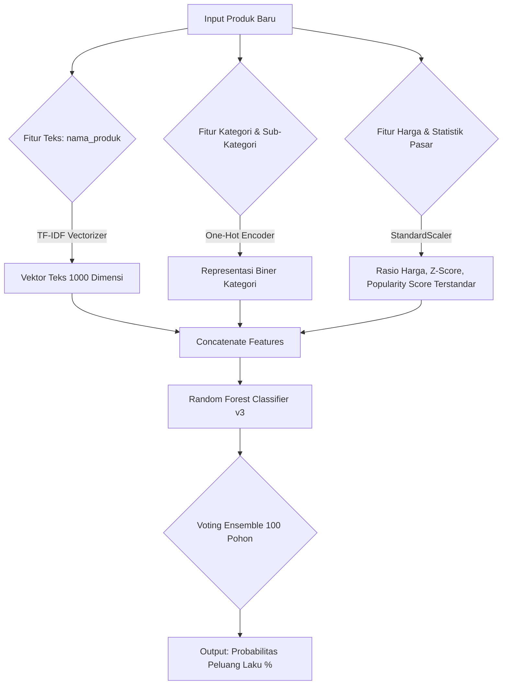
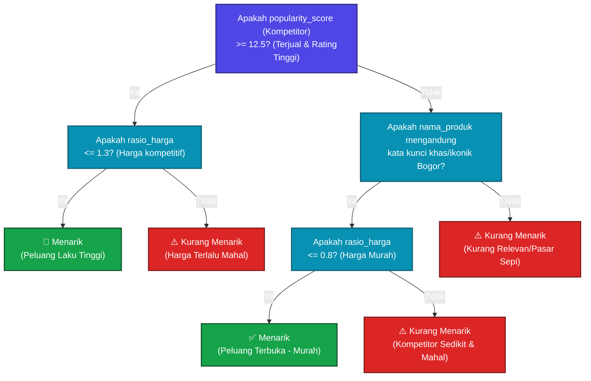

# Aturan Pengambilan Keputusan Model (Random Forest v3)

Berikut adalah representasi alur kerja dan logika pengambilan keputusan (*rules*) dari **Random Forest Pipeline** yang kita gunakan dalam projek RadarUMKM Bogor v3.

## 1. Arsitektur Pipeline Pemrosesan

Sebelum masuk ke pohon keputusan Random Forest, data input diubah terlebih dahulu oleh `ColumnTransformer` menjadi bentuk angka terstandarisasi.

## 2. Logika Aturan Keputusan (Representasi Decision Tree)

Karena Random Forest terdiri dari 100 pohon keputusan (*n_estimators=100*), masing-masing pohon mempelajari kombinasi aturan yang berbeda secara acak. Berikut adalah representasi pohon keputusan tipikal berdasarkan bobot pentingnya fitur (*Feature Importance*) dari model kita:

## 3. Penjelasan Aturan Utama (*Core Rules*)

Model Random Forest v3 menentukan status keaktifan produk berdasarkan hierarki aturan berikut:

1. **Aturan Popularitas Utama (`popularity_score`):**
   - Jika produk sejenis (kompetitor) memiliki performa penjualan historis yang kuat (`jumlah_terjual` tinggi) dan `rating` rata-rata di atas median, model langsung mengklasifikasikan produk ini ke zona potensial laku.
2. **Aturan Elastisitas Harga (`rasio_harga`):**
   - Sekalipun produknya terpopuler, jika harga yang dimasukkan user melebihi **1.3 kali (30% lebih mahal)** dari median pasar kategori tersebut (`rasio_harga > 1.3`), model akan otomatis menurunkan probabilitas kelayakan lakunya menjadi **Kurang Menarik** karena dinilai tidak kompetitif.
3. **Aturan Relevansi Teks (`nama_produk_clean` melalui TF-IDF):**
   - Kata kunci identitas Bogor (seperti *"Lapis Talas"*, *"Roti Unyil"*, *"Kopi Puncak"*) yang memiliki bobot TF-IDF tinggi akan menaikkan skor klasifikasi secara instan karena secara historis produk dengan kata kunci tersebut terbukti sangat diminati di dataset.
