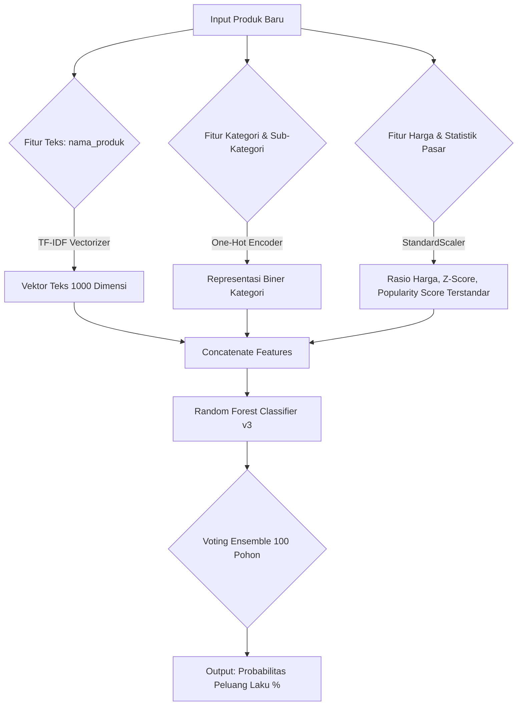
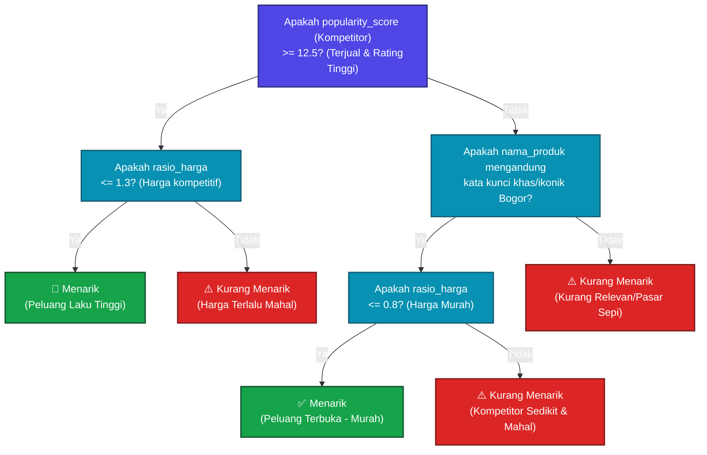

# Visualisasi Random Forest v3

Berikut adalah dua diagram interaktif yang merepresentasikan bagaimana model di *backend* bekerja:

## 1. Arsitektur Pipeline Pemrosesan
Bagaimana data dari input user ditransformasikan sebelum diprediksi:

## 2. Decision Tree Rules (Logika Keputusan)
Ini adalah simulasi 1 dari 100 pohon yang ada di dalam Random Forest. Algoritma mencari kombinasi fitur yang paling berpengaruh secara berurutan:

